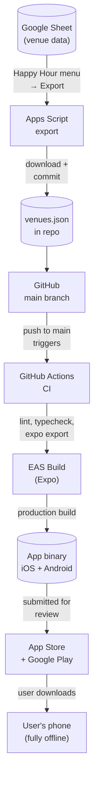

# Architecture

## System design



## How it works

There is no backend. All venue data is bundled into the app binary at build time.

**Data pipeline**

The app owner maintains venue data in a Google Sheet. A Google Apps Script exports the sheet to `data/venues.json` on demand via a toolbar menu item. The exported file is committed to the repo — committing to `main` triggers the full CI and build pipeline automatically.

**On-device**

The app imports `venues.json` directly at build time:

```ts
import venues from '../data/venues.json';
```

All search and filter logic runs locally against this in-memory array. No network requests are made at runtime. The app works fully offline.

**Updating venue data**

1. Edit the Google Sheet
2. Run **Happy Hour → Export venues.json** from the Sheet toolbar
3. Download `venues.json` from Google Drive
4. Replace `data/venues.json` in this repo
5. Commit and push → CI runs → EAS builds a new binary → submit to stores

## CI/CD

| Trigger | Workflow | Steps |
|---|---|---|
| Push or PR to `main` | `ci.yml` | Lint → typecheck → `expo export` |
| Push to `main` (CI passes) | `build.yml` | EAS production build for iOS + Android |

## Key decisions

**No backend in v1** — eliminates hosting costs, ops overhead, and backend development time. The tradeoff is that data updates require a new app release (24–48hr App Store review for iOS). Acceptable for v1 since happy hour schedules change infrequently.

**Google Sheets as CMS** — lower friction than editing raw JSON, shareable with non-developers, and the export script keeps the data shape consistent.

**Expo managed workflow** — no `/ios` or `/android` directories in the repo. All native builds go through EAS, which handles certificates, provisioning profiles, and signing automatically.

**Bundled JSON over CDN fetch** — simpler, offline-capable, no cold-start latency. Migration path if faster updates are needed in v2: host `venues.json` on Cloudflare R2 or Vercel Blob and fetch it at app launch with a local cache fallback.
